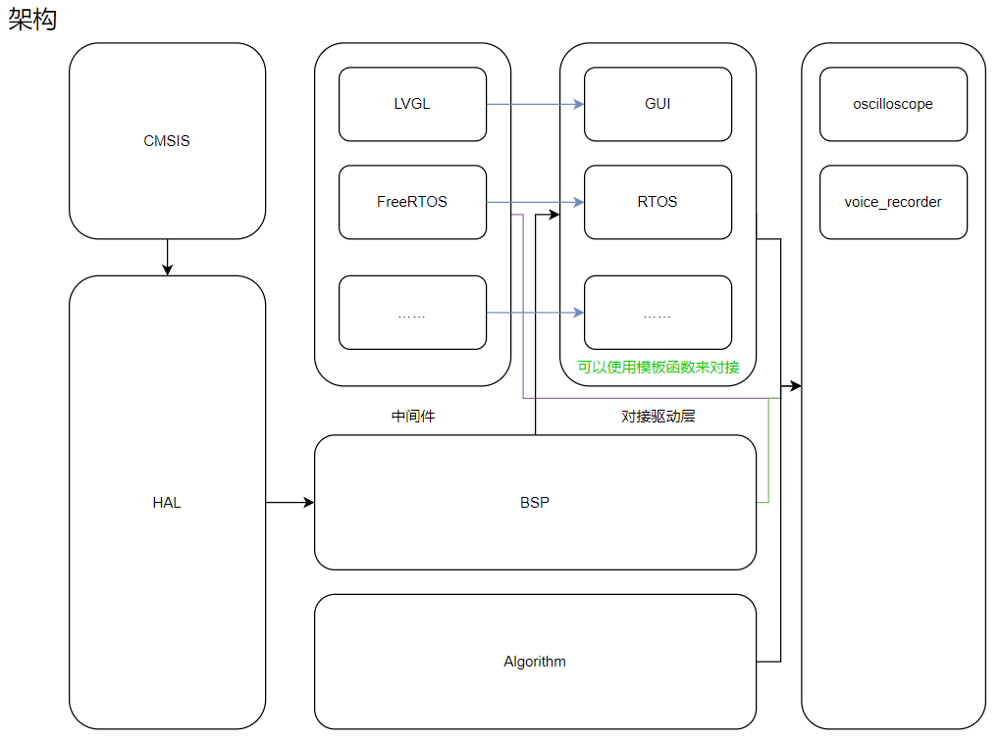
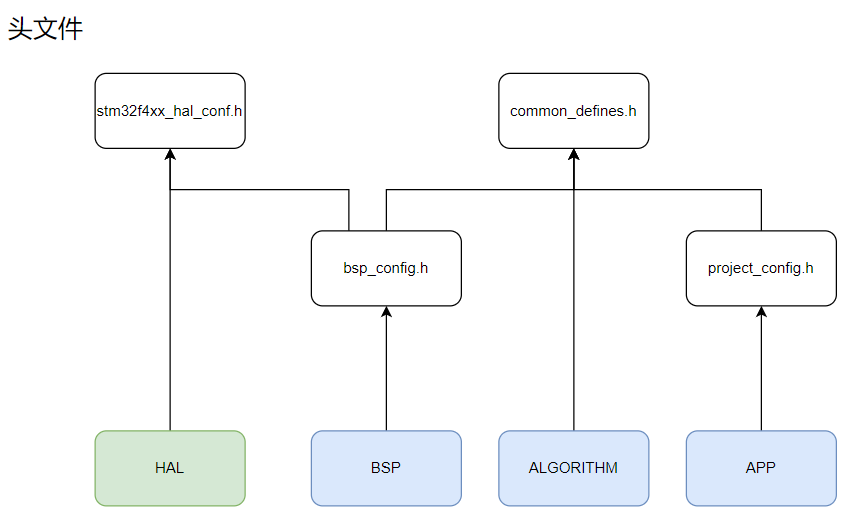

<br>

&nbsp;&nbsp;This is a project based on stm32f407vet6. <br>

___
## 环境   
`IDE`: CLion
<br>
`辅助工具`： GUI Guider &nbsp;&nbsp; STM32CubeMX
<br>
`开发平台`： Windows 11 
<br>
`工具集/链`：
<br>
&nbsp;&nbsp;&nbsp;&nbsp;&nbsp;&nbsp;&nbsp;
[MinGW](https://github.com/niXman/mingw-builds-binaries/releases)
&nbsp;x86_64-14.2.0-release-posix-seh-ucrt-rt_v12-rev0
<br>
&nbsp;&nbsp;&nbsp;&nbsp;&nbsp;&nbsp;&nbsp;
[arm-toolchain](https://developer.arm.com/downloads/-/arm-gnu-toolchain-downloads)
&nbsp;arm-gnu-toolchain-14.2.rel1-mingw-w64-i686-arm-none-eabi
<br>
`分支说明`:main分支是已经测试稳定通过的，ZQ和DV分支是两条测试用的分支  &nbsp;&nbsp;&nbsp;&nbsp;
<br>
`其他`：工程里嵌套了一个模仿GUI Guider的lvgl模拟器，使用SDL2构建，
目录为Adapter/GUI/lvgl_simulator，编译的是32位程序（比64位编译要快）。


___
## 简介
> &nbsp;&nbsp;&nbsp;&nbsp;&nbsp;&nbsp;
> 此为stm32f407vet6的一个C/C++混编工程，适合在同一个开发平台练手用，会不定期更新一些简单基础实验项目供参考。
整个工程使用CMakeLists组织，工程结构如下图




**主要工程目录可分为下面几个部分**
- `Projects`：即项目级，是与硬件无关的部分，为上层应用的实现。源于“多数项目只有逻辑实现、ui界面和调用的驱动不同”，
    把驱动实现、ui界面和应用逻辑实现分离。在Projects下有各个目录，其名称代表各种实验项目，
    如语音存储与回放、双音频信号发生器等。每个项目目录下又有app和ui目录，分别表示应用逻辑和ui界面实现。
<br><br>

- `BSP`：即板级支持包，基于HAL编写的适配于开发板的裸机驱动，若要移植到自己的开发板需要修改配置。
    考虑到兼容性，bsp驱动均使用纯C实现
<br><br>

- `Core`：即SoC内核文件，其下有Drivers、syscall和system子目录，分别存放的是
    HAL驱动、系统调用和系统配置，系统配置里存放的是启动文件和链接脚本。
<br><br>

- `Middleware`：即中间层，用于存放各种第三方库等中间件，比如FreeRTOS、LVGL、FATS等。
    中间件里的各个库均为完备状态，不需要额外依赖。
<br><br>

- `Adapter`：即适配层，用于对接中间层与BSP驱动层，与中间层一一对应。比如GUI目录是为了适配LVGL库，
    在GUI目录下的GUI.hpp实现了lvgl显示和触摸的初始化，采用的是模板函数，避免了额外开销。
    同时GUI内嵌了一个LVGL模拟器，在lv-simulator目录。
<br><br>

- `Algorithm`：即算法层，不依赖驱动，主要实现各种算法，比如绘制、滤波、异步延迟等。
<br><br>

- `Tools`：即工具层，里面存放的是一些配置文件和自动化脚本等。
<br><br>

- `cmake`：即cmake层，里面存放的是一些cmake文件，用于控制文件编译、配置编译工具链、定义公共函数等。
  <br><br>

<br>

####  如何使用CMakelists控制不同实验项目的编译
<p style="text-indent: 2em;">
在工程目录的CMakeLists的头部有如下变量定义，set是CMakeLists的“函数”，用于设置变量。用法为set(变量名 值)，变量名可以是自定义的，
也可以是CMakeLists里定义好的。这里可以看到，设置了一个变量“PROJECT_DIR”，其值为目录“Projects/driversDevelop”，
这就表明要使用“driversDevelop”这个实验项目，即信号发生器（双音频信号发生器）。
<br>
</p>
<p style="text-indent: 2em;">
如果你要使用其他项目，比如语音存储与回放，那么只需要将driversDevelop改为voiceStorage即可。
嵌入的lvgl模拟器，也是如此，在CMakeLists里通过相同的方式来设置。每次修改完成后都要重新cmake一下。
</p>


```cmake
# --------------------------------------选择你的项目--------------------------------
# 如果你是在CLion里，那么可以直接在斜杆后面输入首字母，会自动弹出相关项目选项
set(PROJECT_DIR Projects/driversDevelop)
# --------------------------------------选择你的项目------------------------------
```

<p style="text-indent: 2em;">
那么它是如何实现的呢？在cmake目录下有个target_project.cmake文件，
用于解析CmakeLists传入的PROJECT_DIR变量，然后进行字符串处理，得到项目目录的路径。
</p>

```cmake
# --------对选择的项目进行字符串处理，以匹配对应的UI文件---------
# 提取 APP_DIR 的末尾部分
string(REGEX REPLACE "^.*/(.+)$" "\\1" APP_DIR_LAST_PART "${PROJECT_DIR}")
set(TARGET_PROJECT ${APP_DIR_LAST_PART})
# 设置APP和UI目录
set(APP_DIR ${PROJECT_DIR}/app)
set(UI_DIR ${PROJECT_DIR}/ui)
```


___

## 项目
> &nbsp;&nbsp;&nbsp;&nbsp;&nbsp;&nbsp;
> 本工程由于融合了多个简单实验项目，为避免冲突采用选择性编译的方法，原理在上文中提到。
    同时为了管理工程，使用了下面几个头文件，其内部使用到了各种宏定义，它们均由cmake自动生成。


### _说明_：
- 为方便管理，上述几个头文件均由cmake自动生成，除了stm32f4xx_hal_conf.h在Drivers目录外，
    其余头文件均在构建目录下的build/inc目录
<br><br>
-  不同层用不同头文件控制，bsp层由bsp_config.h控制，中间层和项目层均由project_config.h控制。
<br><br>
- 更多相关详细介绍请查看Docs/help目录下的文档介绍，其内介绍了开发驱动、开发项目文件的规范及注意事项。
<br><br>


___

## 语言规范：
>为了让项目的代码规范一点，我们约定了一些规则。


<p style="text-indent: 2em;">
框架主体使用的是FreeRTOS，除了FreeRTOS本身自由、简单易上手的特点外，
另一点是CLion集成了FreeRTOS的图形化调试，非常直观。对于一些简单实验项目，采用的是裸机。同时，把整体开发流程主要分为了驱动、模块、应用三级，
同时这些驱动、模块、应用相关文件由一个xxx_Conf.h来控制，决定了哪些文件可以被编译。<br><br>
</p>

### _注意事项_：<br><br>
- `接口兼容性`：BSP统一使用C接口。而模块级与应用级则使用C++接口，方便开发，比如可以使用重载、引用、自动类型推导、lambda表达式、返回类型后置、结构化绑定等.
             只不过看着驱动开发里的C代码，总想用C++提高代码复用，唉兼容性…… <br><br>
- `文件命名规范`：BSP和模块级尽量小写为主，不同属性尽量用下划线隔开，方便调用接口；
应用级尽量采用驼峰命名法。之所以是尽量，是因为C/C++的命名本来就已经很混乱了哈哈哈哈哈<br><br>
- `函数`：为了提高驱动性能，实现简单功能的函数尽量内敛，其内局部变量尽量使用字长单位<br><br>
- `变量`：尽量控制全局变量的使用，命名要规范<br><br>
- `调试`：统一开-O2级别优化，遇到问题再开-Og。在CLion里面体现为使用Release选项。同时要注意volatile变量的使用<br><br>
- `语法使用规范`：由于单片机资源有限，不能过度使用泛型编程如模板。类可以使用，尽量使用静态类以实现零成本抽象，
避免实例化对象，尤其是new的使用。<br><br>


### _C++特性_:<br><br>
>适合单片机开发的一些C++特性，在尽可能减少开销的情况下尽量提升开发效率。

<!--C++中适合单片机开发的新特性，C++11以后每三年一个版本，且按照Major-Minor-Minor进行迭代
C++20与C++23基本都是对标准库、泛型编程等进行了优化，很难用到单片机上。尤其是那该死的模块，听说MSVC支持的比较好，
cmake也还行，但是试来试去就是不行，淦。-->

```c++
 * // -------------------------------------C++98-------------------------------------
 *
 * 【命名空间】：命名空间是C++中唯一一种作用域机制，它允许将变量、函数、类等定义放在一个独立的命名空间中，避免命名冲突。
 *          在单片机开发中，我感觉它与静态类没有太大区别（不讨论封装、继承的情况下），但命名空间只是逻辑上的隔离，并不会带来格外的开销。
 *          话说，感觉有用但与静态类比起来有种鸡肋的感觉，真没办法，毕竟用不了泛型编程、继承、多态什么什么的。
 *             11-8 现在我觉得还是有用的，比如匿名函数空间，专治各种函数变量暴露狂，简直就是闭包
 *
 *
 * // -------------------------------------C++11-------------------------------------
 *
 * 【constexpr】：允许在编译时计算常量表达式，减少了运行时的开销。C++20中进一步提升了性能
 *      constexpr int square(int x) {return x * x;}
 *      constexpr int result = square(5);  // result 在编译时计算
 *
 * 【范围-based for 循环】：允许在循环中迭代容器中的元素，简化代码。即简化了索引操作，避免潜在管理错误
 *      for (auto& elem : array) {elem *= 2;}
 *
 * 【自动类型推导】：允许在函数参数中省略类型声明，让编译器自动推导类型。这个没什么好说的。但是要注意使用场合，像【范围-based for 循环】、【lambda表达式】
 *                等一些类型复杂或者显而易见的场景，这样做可以让代码简洁。对于类型不明显或容易混淆的场景，比如基本类型变量、函数参数、等，还是建议显式声明类型，避免使用泛滥
 *      auto add(int a, int b) {return a + b; }// 可以推导出返回值类型为 int，与返回类型后置差不多
 *
 *
 *  // -------------------------------------C++14-------------------------------------
 *
 *  【泛型 lambda 表达式】：允许在函数内部定义lambda表达式，使得代码更加简洁，不再又是声明又是定义的。
 *          auto print = [](auto x) {std::cout << x << std::endl;};
 *
 *  【返回类型后置】：这他宝贝的才是我喜欢的函数定义语法，跟Koltin里一样，可以使复杂的函数签名更易读。只不过前面还是要加上auto真是麻烦
 *          auto square(int x) -> int { return x * x;}
 *
 *
 * // -------------------------------------C++17-------------------------------------
 *
 * 【if 和 switch 初始化器 】：允许在if语句和switch语句中初始化变量。避免局部变量到处都是，全他宝贝的污染
 *      比如：if (auto value = read_sensor(); value > threshold){}
 *
 * 【[[nodiscard]]】：用来标记函数返回值不应该被忽略，防止潜在错误
 *      比如：[[nodiscard]] bool check_error() {}
 *
 * 【结构化绑定】：跟Koltin里的解构差不多，就是当函数返回值类型为结构体之类的，可以让函数返回多个值
 *      std::pair<int, int> coords = get_coordinates();
 *      auto [x, y] = get_coordinates();
 *
 * 【内联变量】：可以在头文件中直接定义静态成员变量，而不会导致重复定义的问题。这个嘛不一定用得上
  ```
___

## CLion开发体验提升
`自动化脚本`
<br>
&nbsp;&nbsp;&nbsp;&nbsp;&nbsp;&nbsp;
    为了更快地开发，创建bsp驱动文件与创建项目目录的过程均被封装为了cmake函数，
    在cmake目录下的common_functions.cmake文件中。可以通过在CMakeLists中调用
    create_bsp()和create_project()来快速创建bsp驱动文件与项目目录。
<br>
&nbsp;&nbsp;&nbsp;&nbsp;&nbsp;&nbsp;
示例如下，在CMakeLists添加了相应函数，并向里面传入名称，然后重新cmake一下
即可自动创建相关目录及模板文件。模板文件在Tools/templates，可自行修改

```cmake
# --------------------------------------选择你的项目--------------------------------
# 如果你是在CLion里，那么可以直接在斜杆后面输入首字母，会自动弹出相关项目选项
set(PROJECT_DIR Projects/driversDevelop)

# 创建test项目目录，其下有ui和app目录，并且各目录下有相应文件
create_project(test)
```


___
**人员**：WJY、WZX、XZQ &nbsp;&nbsp;&nbsp; 软件：JY、ZQ &nbsp;&nbsp; 硬件：ZX <br>
<!-- ZQ发起&开发&维护  JY开发  ZX硬件支持-->
